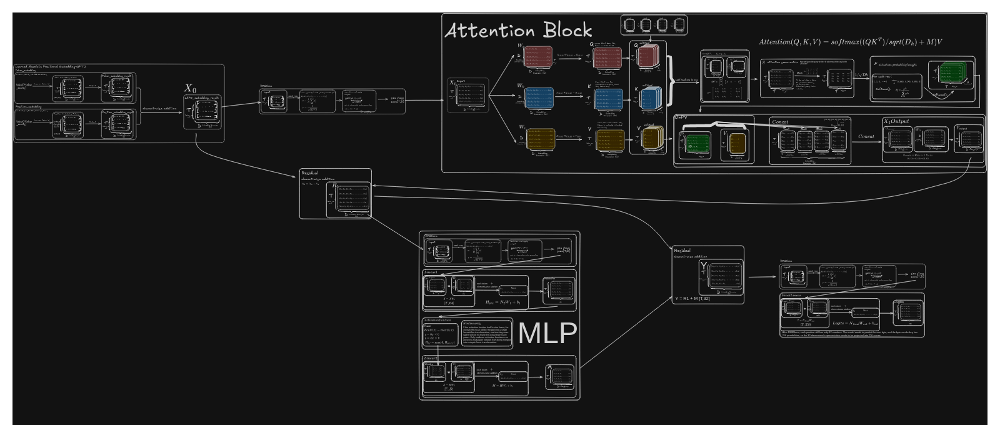

# miniLLM: Train a Small Transformer from Scratch in C11

miniLLM is a complete, runnable decoder-only Transformer built for learning. It
does not depend on PyTorch, BLAS, tokenizer libraries, or other third-party
code. The implementation uses only the C11 standard library and `<math.h>`, and
includes training, inference, explicit backpropagation, AdamW, checkpoints, a
CLI, numerical gradient checks, and end-to-end tests.

The "mini" part matters: the default model has only 34,400 parameters. The goal
is to make the entire implementation understandable from beginning to end, not
to compete with modern language models in speed or capability. Large language
models use the same core ideas at a much greater width and depth, together with
highly optimized matrix libraries, parallel hardware, and enormous datasets.

## Personal Learning Notes and Reflections

These two files capture my understanding of the model, its tensor shapes, and
the complete data flow. The SVG is the primary and most detailed resource; the
DOCX is a formatted companion document.

[](docs/miniLLM.svg?raw=1)

- **Primary:** Click the preview to open the full miniLLM learning map (SVG,
  about 3.9 MiB).
- **Companion:** [Download the formatted learning notes (DOCX)](docs/miniLLM_learn_formatted.docx).

The SVG is linked instead of embedded because its large canvas and file size
make inline rendering in a README unreliable. Open the link directly, or
download the file and view it in a browser or vector graphics viewer.

## 1. Quick Start

On Linux/macOS, or in a Windows terminal where CMake is available in `PATH`:

```console
cmake -S . -B build -DCMAKE_BUILD_TYPE=Release
cmake --build build
ctest --test-dir build --output-on-failure
```

Train on the sample corpus and save a checkpoint:

```console
./build/minillm train data/tiny.txt tiny.bin 1000 0.003
```

On Windows, the executable is usually `build\minillm.exe`:

```console
build\minillm.exe train data\tiny.txt tiny.bin 1000 0.003
build\minillm.exe generate tiny.bin "the " 300 0.8 32
```

Resume training or inspect a checkpoint:

```console
build\minillm.exe resume tiny.bin data\tiny.txt 500 0.001
build\minillm.exe info tiny.bin
```

CLion users can open the root `CMakeLists.txt` directly and run either the
`minillm_cli` or `minillm_tests` target. The project requires strict C11, and
CMake disables GNU extensions.

## 2. What Happens During Training?

Suppose the corpus contains these bytes:

```text
h e l l o
```

The input is `h e l l`, while the target is the same sequence shifted one
position to the right: `e l l o`. At every position, the model predicts the
next byte, and the loss is the mean cross-entropy across all positions.

```text
byte id
   |
   |-- token embedding ----+
   `-- position embedding -+-> x
                               |
                   +-----------v------------+
                   | RMSNorm                 |
                   | causal multi-head       |
                   | self-attention          |
                   | + residual              |
                   | RMSNorm -> MLP -> +resid| x n_layers
                   +-----------+------------+
                               |
                          final RMSNorm
                               |
                        linear -> 256 logits
                               |
                      softmax + cross-entropy
```

One call to `minillm_train_step()` performs four operations:

1. Randomly select `context_length + 1` bytes from the corpus.
2. Run `forward()` to compute logits and mean cross-entropy.
3. Run `backward()` in reverse order to compute every parameter gradient.
4. Run `minillm_apply_gradients()` to update the parameters with AdamW.

Inference has no target sequence and does not run backpropagation. It samples a
new byte from the final-position logits using temperature and top-k sampling,
appends that byte to the context, and repeats.

## 3. Project Map and Suggested Reading Order

The implementation is organized by learning topic instead of being placed in a
single thousand-line source file:

```text
src/
|-- core/       parameters, model lifecycle, random numbers, forward cache
|-- layers/     linear layers, RMSNorm, causal multi-head attention
|-- model/      complete forward and backward passes
|-- training/   gradient clipping, AdamW, one training step
|-- inference/  temperature, top-k, autoregressive generation
|-- io/         checkpoint save and load
`-- internal/   shared data structures and internal declarations
```

Start with [`docs/00-LEARNING-PATH.md`](docs/00-LEARNING-PATH.md), which divides
the project into nine small learning stages. You do not need to understand
backpropagation on the first pass.

| Order | File or function | Focus |
|---:|---|---|
| 1 | `include/minillm.h` | Build a high-level view from the public API |
| 2 | `src/main.c` | See how training, saving, and generation connect |
| 3 | `src/core/model.c` | Learn the parameter set, shapes, and initialization |
| 4 | `src/layers/` | Study linear, RMSNorm, and attention one at a time |
| 5 | `src/model/forward.c` | Follow embeddings, attention, MLP, and loss |
| 6 | `src/model/backward.c` | Apply the chain rule in reverse graph order |
| 7 | `src/training/optimizer.c` | Understand gradient clipping and AdamW |
| 8 | `src/inference/generate.c` | Follow sliding context and autoregressive sampling |
| 9 | `tests/test_minillm.c` | See how gradients, training, and checkpoints are verified |

Track array shapes while reading. The most common symbols are:

- `T`: current token count;
- `D`: `d_model`;
- `H`: number of attention heads;
- `Dh = D/H`: width of each attention head;
- `F`: MLP hidden width;
- `V = 256`: byte vocabulary size.

Read the visual overview in
[`docs/01-ARCHITECTURE.md`](docs/01-ARCHITECTURE.md), followed by the formulas in
[`docs/DERIVATION.md`](docs/DERIVATION.md). Each `src` subdirectory also has a
focused README that explains only that module.

## 4. Why Use a Byte Tokenizer?

The vocabulary is exactly `[0, 255]`, so every byte in a file is already a
token ID. This approach has no tokenizer dependency, never produces an unknown
token, and accepts any file as input. The tradeoff is sequence length: for
example, a Chinese UTF-8 character commonly occupies three bytes. This is a
useful educational tradeoff because it keeps tokenization transparent; a BPE
tokenizer can be implemented later as a separate extension.

## 5. Default Model

| Setting | Default value |
|---|---:|
| Vocabulary | 256 bytes |
| Context length | 32 |
| Model width | 32 |
| Attention heads | 4 |
| Transformer blocks | 2 |
| MLP width | 64 |
| Parameters | 34,400 |

All matrices are row-major, one-dimensional `float` arrays. Matrix
multiplication uses ordinary triple loops. This is far slower than an optimized
library, but every multiply-add can be traced directly. The default model is
suited to small corpora and proof-of-concept experiments; it is not expected to
produce text comparable to commercial language models.

## 6. Why the Tests Are Meaningful

The tests verify more than whether the program avoids crashing:

- **Finite-difference gradient checks:** approximate a parameter derivative
  directly from the loss definition and compare it with `backward()`. This
  catches chain-rule, scaling, and indexing errors.
- **Tiny overfit test:** require the model to reduce loss substantially on a
  repeating `abc` corpus.
- **Checkpoint round trip:** require every parameter to remain bit-identical
  after saving and loading.
- **Deterministic generation:** after saving random-number state, require the
  original and restored models to generate the same bytes.
- **Invalid configuration checks:** reject configurations where `d_model` is
  not divisible by the number of heads.

For random initialization, the theoretical cross-entropy of a uniform
prediction over 256 classes is approximately `ln(256) = 5.545`. An initial loss
far from that value usually indicates a problem in softmax, cross-entropy, or
initialization.

## 7. Suggested Extensions

Change one thing at a time and keep the gradient and overfit tests passing:

1. Replace ReLU with GELU and derive its gradient.
2. Add learning-rate warmup and cosine decay.
3. Tie the output weights to the token embedding weights.
4. Add a validation split and report training and validation loss separately.
5. Implement batch training instead of one sequence per step.
6. Build a minimal BPE tokenizer.
7. Define an explicit byte order for portable checkpoints.
8. Add SIMD, threading, or BLAS last, comparing each optimization with this
   transparent baseline.

## 8. Project Scope

"Standard library only" means that the source includes only ISO C standard
headers. `<math.h>` is part of the C standard library, although some Unix
toolchains expose the system math library as a separate `libm` link target;
CMake handles that automatically. The build system and compiler are not runtime
dependencies.

Checkpoints store native integer and `float` representations. They are suitable
for learning experiments on the same architecture, but they are not a
long-term, production-grade interchange format. Training also omits GPU
acceleration, batching, mixed precision, and parallelism. These constraints are
intentional: the project provides a transparent, correct, and testable
baseline first.
